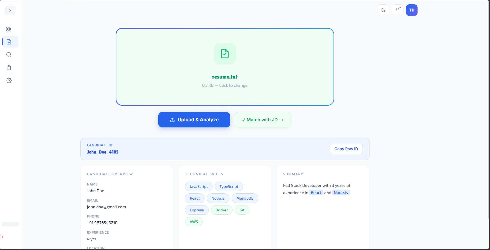
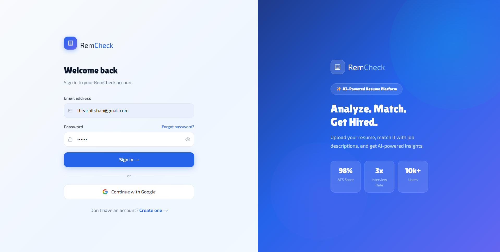
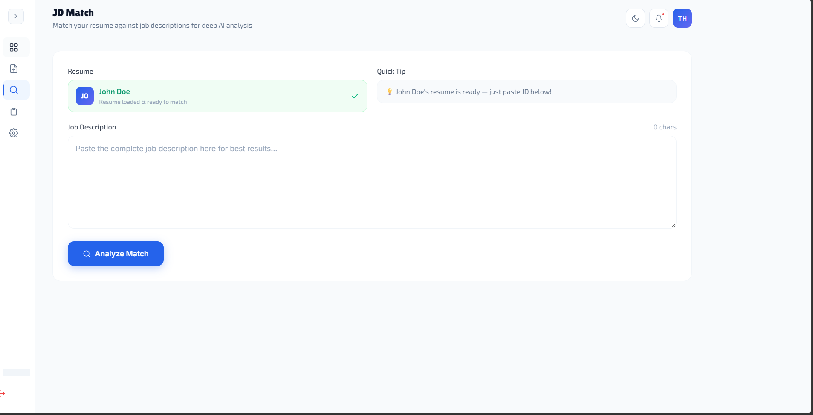
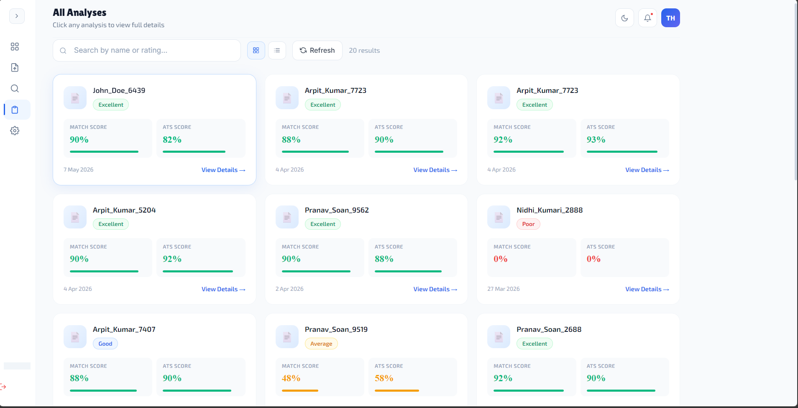
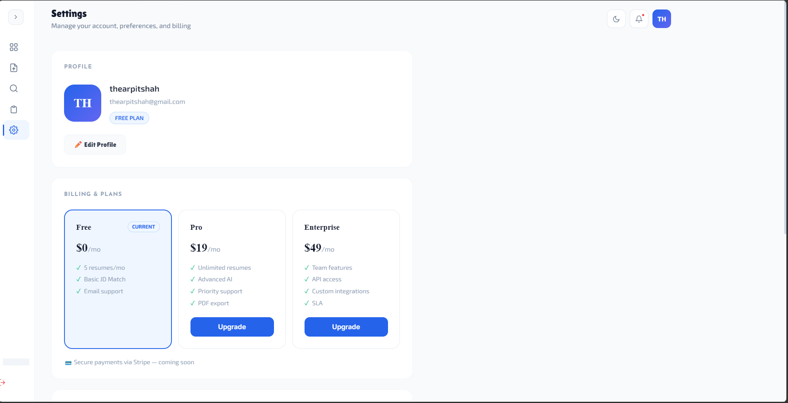

# RemCheck AI

An AI-powered Resume Analyzer platform that helps users understand why their resumes get rejected and how to improve them for better ATS performance and job matching.

---

## 🚀 Features

- 📄 Resume Upload & Analysis
- 🤖 AI-Powered Resume Feedback
- 🎯 Job Description Matching
- 📊 ATS Score Calculation
- 🔍 Skills Gap Detection
- 🛠 Resume Improvement Suggestions
- 🔐 Authentication System
- ⚡ Modern Responsive UI
- ☁️ Full Stack Deployment

---

## 🛠 Tech Stack

### Frontend
- React.js
- Tailwind CSS
- Vite
- Axios

### Backend
- Node.js
- Express.js
- Supabase
- Gemini AI API

### Deployment
- Vercel (Frontend)
- Render (Backend)

---

# 📸 Project Screenshots

## 🏠 Home Page


---

## 🔐 Login Page


---

## 📄 Resume & JD Analysis


---

## 📊 All Analysis Dashboard


---

## ⚙️ Settings Page


---

# ⚡ Installation

## Clone Repository

```bash
git clone https://github.com/ArrpitShah/Ai-Resume-Analyzer-.git
